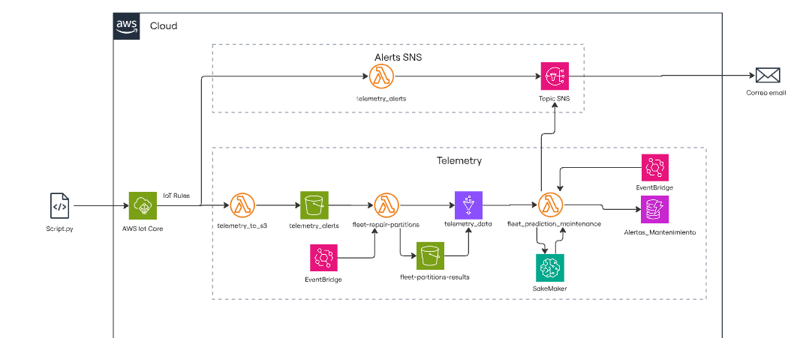

# Plataforma de Gestión de Flotas

**Descripción del proyecto**  
Construir una plataforma de gestión de flotas vehiculares con tracking GPS en tiempo real, optimización de rutas, telemetría del vehículo, alertas de mantenimiento predictivo y dashboards de KPIs operacionales.

## Resumen del flujo 
1. **Simulación (20 vehículos)**  
   - La simulación de 20 vehículos se genera con **SUMO** y se publica por **MQTT** usando `simulator_traffic.py` (carpeta `Medellin_traffic/`).
2. **Recepción (AWS IoT Core)**  
   - AWS IoT Core recibe los mensajes y, mediante **IoT Rules**, los envía a dos ramas principales:
     - **Rama de Alertas inmediatas** → `telemetry_alerts` (Lambda) → **SNS** (email) si se cumplen condiciones simples.
     - **Rama de Telemetría & Predicción** → `telemetry_to_s3` (Lambda) → **S3** (bucket `telemetry_alerts`) → procesamiento/particionado → metadatos en **Glue** (`telemetry_data`) y resultados de particionado en `fleet-partitions-results`.  
3. **Predicción de mantenimiento**  
   - `fleet_prediction_maintenance` (Lambda) consulta la tabla de Glue (`telemetry_data`) para obtener los últimos datos en intervalos de **4 minutos por vehículo** y llama al **endpoint de SageMaker** para predecir si requiere mantenimiento (modelo XGBoost entrenado localmente y registrado en SageMaker).  
   - Resultado: guarda la alerta en **DynamoDB** y publica una notificación por **SNS**.

## Arquitectura del sistema



---

## Variables / Nombres esperados (personalizables)
Estos nombres se usan en las Lambdas y scripts (usar como referencia/variables de entorno):
- `AWS_IOT_ENDPOINT` — endpoint IoT (ej.: `a3xxxxxx-ats.iot.region.amazonaws.com`)
- `MQTT_TOPIC` — tópico donde publica `simulator_traffic.py` (ej.: `fleet/telemetry`)
- `S3_BUCKET_TELEMETRY` — `telemetry_alerts`
- `S3_BUCKET_PARTITIONS` — `fleet-partitions-results`
- `GLUE_DATABASE` — `fleet_db`
- `GLUE_TABLE` — `telemetry_data`
- `SAGEMAKER_ENDPOINT` — endpoint de inferencia XGBoost
- `DYNAMO_TABLE_ALERTS` — tabla para almacenar alertas
- `SNS_TOPIC_ARN` — tópico para notificaciones por email

Asegúrate de configurar estos valores como **variables de entorno** en cada función Lambda o en un archivo `.env` local para scripts.

---

## Pasos de despliegue (alto nivel)

### 1) Configurar SUMO + Simulador
1. Instala SUMO y exporta `SUMO_HOME`.
2. En `Medellin_traffic/`, revisa los archivos de configuración de SUMO.
3. Instala dependencias:  
   ```bash
   pip install -r Medellin_traffic/requirements.txt
   ```
4. Ejecuta la simulación (ejemplo):  
   ```bash
   python Medellin_traffic/simulator_traffic.py 
   ```
   El script debe publicar mensajes MQTT al **endpoint de AWS IoT** usando certificados o credenciales configuradas.

### 2) Crear recursos AWS básicos
- **S3**: crear buckets `telemetry_alerts` y `fleet-partitions-results`.
- **DynamoDB**: crear tabla `alerts`.
- **SNS**: crear tópico y suscribir correo(s) para recibir notificaciones.
- **Glue**: crear base de datos `fleet_db` y tabla `telemetry_data` (o crear el crawler para inferir esquema).
- **SageMaker**: registrar y desplegar endpoint con el modelo XGBoost (el notebook `Sakemaker/register_model.ipynb` guía esto).

### 3) Crear IAM Roles & Policies (Lambda)
Cada Lambda necesita un role con permisos mínimos. Ejemplo de permisos (simplificado):
- S3: `s3:GetObject`, `s3:PutObject`, `s3:ListBucket`
- Glue: `glue:GetTable`, `glue:GetDatabase`, `glue:GetPartitions`
- SageMaker: `sagemaker:InvokeEndpoint`
- DynamoDB: `dynamodb:PutItem`, `dynamodb:UpdateItem`
- SNS: `sns:Publish`
- CloudWatch Logs: `logs:CreateLogGroup`, `logs:CreateLogStream`, `logs:PutLogEvents`

Puedes usar AWS SAM o CloudFormation para generar roles con políticas correctamente limitadas.

### 4) Deploy de las Lambdas
Opciones:
- **Manual**: empaqueta el código de cada carpeta dentro de `functionLambda/` y súbelo a AWS Lambda (configura tiempo de ejecución, variables de entorno, rol).
- **Automatizado**: usar **AWS SAM** o **Serverless Framework** (recomendado para reproducibilidad).

Variables importantes en cada Lambda:
- `telemetry_to_s3`: `S3_BUCKET_TELEMETRY`
- `telemetry_alerts`: `SNS_TOPIC_ARN`
- `fleet-repair-partitions`: `S3_BUCKET_PARTITIONS`
- `fleet_prediction_maintenance`: `GLUE_DATABASE`, `GLUE_TABLE`, `SAGEMAKER_ENDPOINT`, `DYNAMO_TABLE_ALERTS`, `SNS_TOPIC_ARN`

### 5) Configurar IoT Core & IoT Rule(s)
- Crea una **IoT Thing** o confirma acceso desde tu script SUMO (cliente MQTT).
- Genera y descarga certificados o usa autenticación por políticas.
- Crea **IoT Rule** que, sobre el tópico de telemetría, ejecute:
  - **Acción Lambda** → invocar `telemetry_alerts` (alertas inmediatas).
  - **Acción Lambda** → invocar `telemetry_to_s3` (persistencia cruda).
  *(Nota: la tercera ramificación pendiente, no se añade en este README.)*

Ejemplo simplificado de SQL para IoT Rule:
```sql
SELECT * FROM 'fleet/telemetry'
```

### 6) Orquestar predicciones cada 4 minutos
- Crea una regla de **EventBridge (Scheduled)** que dispare la Lambda `fleet_prediction_maintenance` cada 4 minutos.
- Alternativa: puedes invocar la Lambda ad-hoc tras cada particionado; en este diseño se usa el trigger periódico para agregación por ventana de 4 minutos.

---
## Archivos de código relevantes y ubicación
- Simulador & SUMO: `Medellin_traffic/simulator_traffic.py`
- Entrenamiento y dataset: `ModelML/`
- Notebook de registro (SageMaker): `Sakemaker`
- Lambdas: `functionLambda/`
- Frontend: `Frontend/`

---


